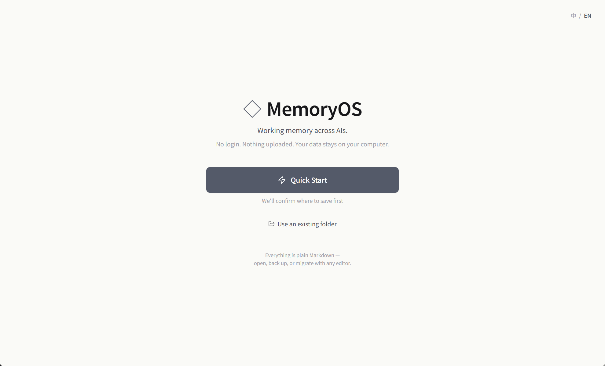
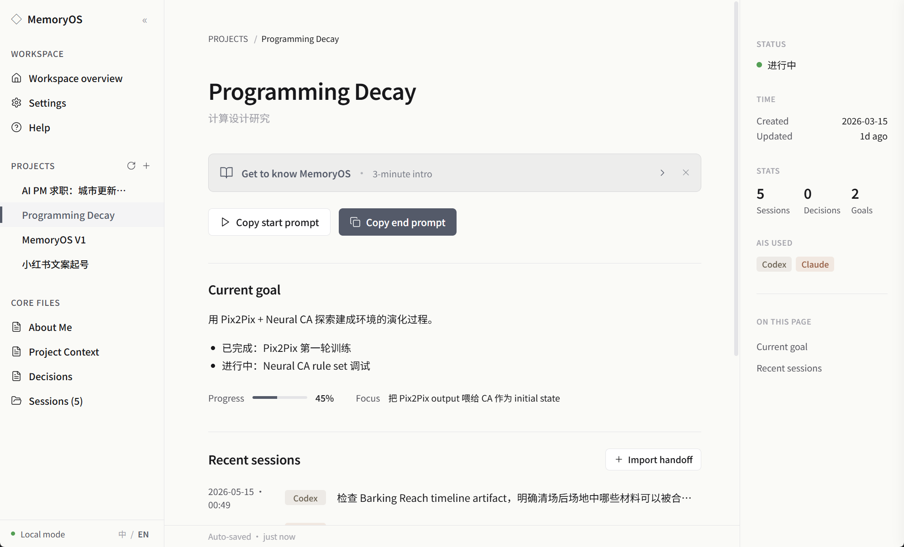
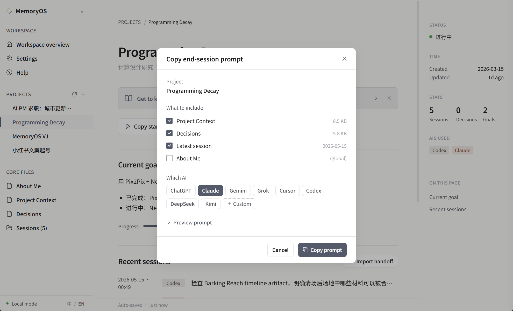
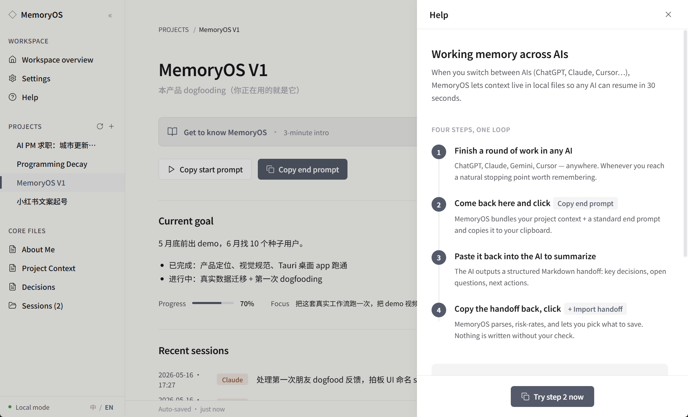

# ◇ MemoryOS

> Working memory across AIs — local-first, no login, your data stays on your computer.
>
> *Your Context. Any AI. Every Workflow.*

[中文](./README.md) · [Download](../../releases) · [Issues](../../issues)

MemoryOS is a local-first desktop app that gives you continuous working memory across ChatGPT, Claude, Gemini, Cursor, and others. Your context lives as plain Markdown files on your own machine — nothing uploaded, no account, no cloud.



---

## What it solves

Every time you switch between AIs, you lose continuity. ChatGPT Memory only works inside ChatGPT. Claude Projects only inside Claude. After three months of copy-pasting "here's who I am again," you'll want to throw your keyboard.

MemoryOS doesn't replace any AI tool — it's the *working-memory layer* between them.

---

## The loop

```
[Open any AI in a fresh chat]
    ↓
Click "Copy start prompt"
    ↓
Paste into the AI → it loads your context
    ↓
Work for a while…
    ↓
Click "Copy end prompt"
    ↓
Paste into the AI → it generates a structured handoff
    ↓
Copy handoff back into MemoryOS → click "+ Import handoff"
    ↓
Review → Save
```

Next time, any AI picks up from the handoff in 30 seconds.



---

## What "Copy end prompt" does

Click the button — MemoryOS bundles your selected context files + a standardized end-session prompt into your clipboard. Pick which AI you're in (ChatGPT / Claude / Gemini / Grok / Cursor / Codex / DeepSeek / Kimi, or a custom name), paste, and the AI outputs a Markdown handoff in the fixed schema.



---

## Principles

1. **Local-first** — every file is yours, plain Markdown
2. **AI proposes, you confirm** — nothing writes to disk without your checkbox
3. **Append-first** — existing content is never overwritten
4. **No conversation scraping** — handoffs are user-pasted, never auto-read
5. **Risk-tiered import** — sessions are low-risk, project context medium, About-Me high (default off + warning)
6. **Reversible delete** — projects go to system trash with a 5-second in-app Undo

---

## Features

- 🌍 **Full bilingual UI** — one-click switch (中 / EN), UI + prompt templates + sample project all follow
- 🗂 **Multi-project workspace** — sidebar manages projects and core files
- 🤖 **8 preset AIs + custom** — ChatGPT / Claude / Gemini / Grok / Cursor / Codex / DeepSeek / Kimi
- 🛡 **System-trash delete** — projects go to OS recycle bin with 5-second in-app Undo
- 📝 **Pure Markdown** — open files in Obsidian, VS Code, anywhere
- 🎯 **Risk-tiered import** — AI's suggested updates are grouped by risk; you pick what saves



---

## Install

### Use the installer (Windows, recommended)

Grab the latest `.exe` (one-click) or `.msi` (managed install) from [Releases](../../releases).

Windows will show an "unknown publisher" warning (no code-signing yet). Click "More info → Run anyway." The app doesn't go online or touch anything outside the folder you pick.

### Build from source

Requires Node 18+, Rust 1.70+, and on Windows: VS Build Tools (Desktop C++).

```bash
git clone https://github.com/jiajiajiang91-design/memoryos.git
cd memoryos
npm install
npm run tauri dev      # development
npm run tauri build    # production installer
```

---

## Where your data lives

Default `~/Documents/MemoryOS/`:

```
MemoryOS/
├── about_me.md                          ← long-term identity (global)
└── projects/
    └── <project-name>/
        ├── project.json                  ← metadata
        ├── 00_context.md                 ← project snapshot
        ├── decisions.md                  ← key-decisions log
        └── sessions/                     ← handoff archive
            ├── session_2026-05-15_1746.md
            └── session_2026-05-16_0030.md
```

Any editor opens these (Obsidian, VS Code, Notepad). Copying the folder is a full backup.

> File names stay English for AI recognition + tool interop; the UI displays friendly names ("About Me / Project Context / Decisions / Sessions") in your chosen language.

---

## Stack

- **Tauri 1.5** — Rust-core desktop framework (50× smaller than Electron)
- **React 18 + TypeScript** — frontend
- **Tailwind CSS** — Notion-style slate-and-paper design
- **`trash` crate** — cross-platform OS trash via Rust
- **Vite** — build

Windows installer is ~**1.7 MB**.

---

## What it doesn't do

- ❌ Cloud sync, accounts
- ❌ Built-in AI chat (not competing with ChatGPT / Claude)
- ❌ Browser extensions
- ❌ Mobile
- ❌ Auto-scraping AI conversations (handoffs are always user-pasted)

These "don'ts" are the product position, not a TODO list.

---

## Roadmap

- [x] v0.1.0 — Core loop, project management, bootstrap, Windows installer
- [x] **v0.1.1 — Bilingual UI / system-trash delete + Undo / UX polish** (current)
- [ ] v0.2 — Workspace switching, settings panel, dark mode
- [ ] v0.3 — Mac / Linux builds, code-signing
- [ ] v1.0 — In-app Markdown editing (not just viewer)

---

## Feedback

[Issues](../../issues) welcome. Most useful kinds:
- Where you got stuck during onboarding
- Features you wanted but couldn't find
- Features you'll *never* use (this one matters more)

---

## License

[MIT](LICENSE) © 2026 Jiajia
