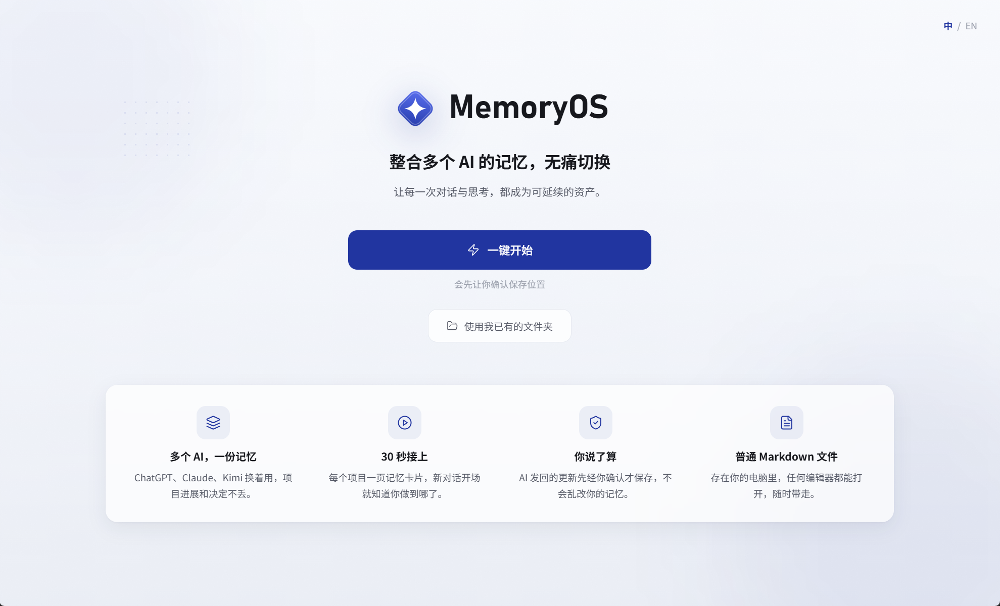
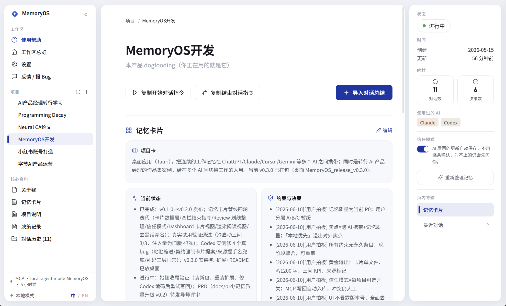
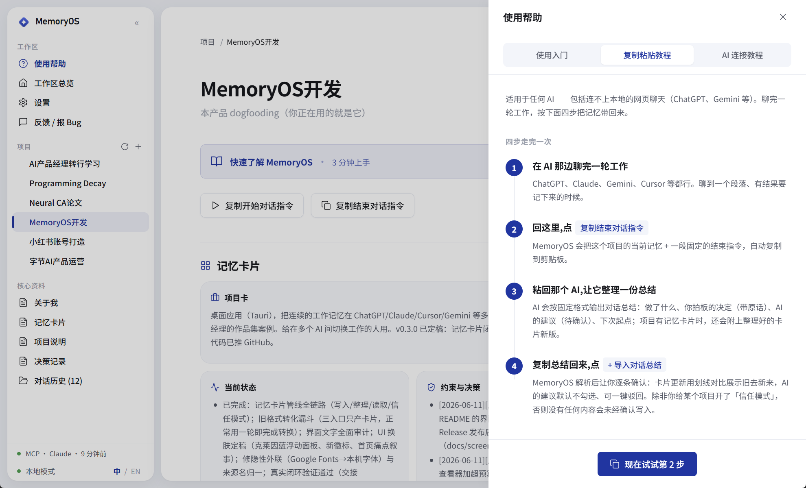
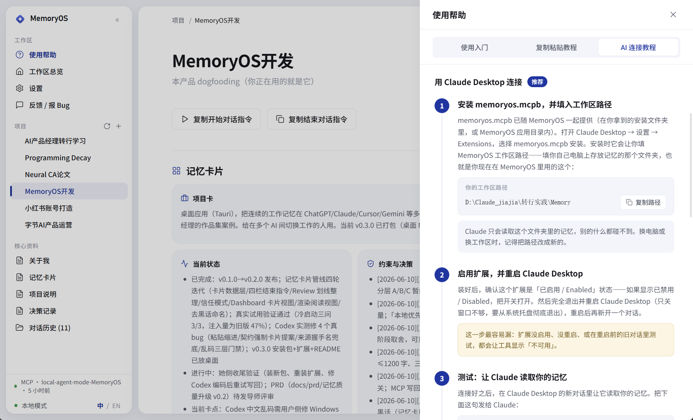
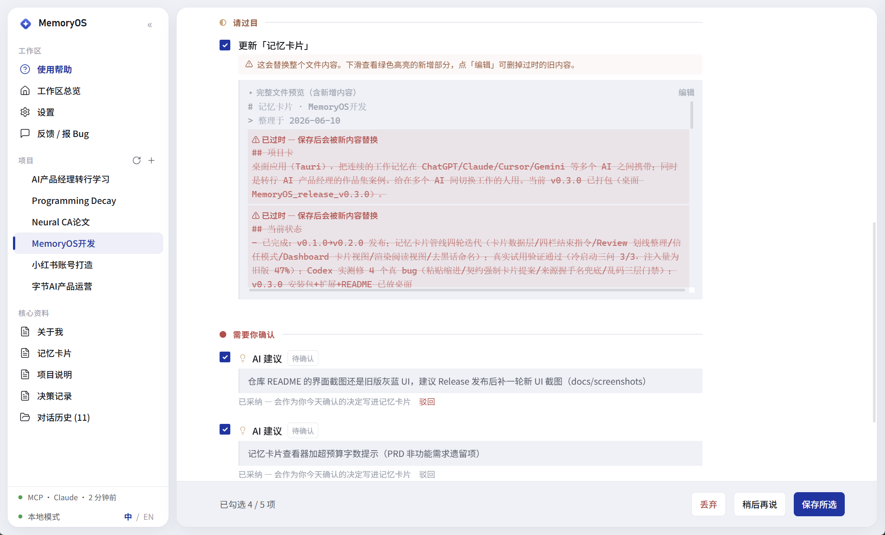
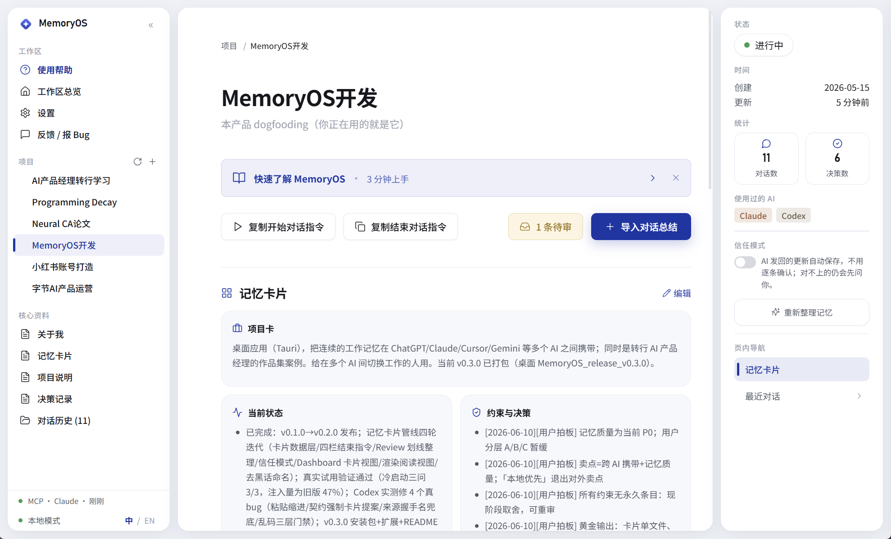

# ◇ MemoryOS

> One memory across all your AIs — switch without losing the thread.
>
> *Every conversation and every thought becomes an asset that carries forward.*

[中文](./README.md) · [Download](../../releases) · [Issues](../../issues)

MemoryOS is a desktop app that consolidates your working memory across ChatGPT, Claude, Gemini, Cursor, and others into **one page of "memory cards" per project**. Hand that page to any AI at the start of a new chat and it picks up your progress within 30 seconds. Everything is plain Markdown on your own computer — no account, nothing uploaded.



> Screenshots show the Chinese UI; the app is fully bilingual (中 / EN, one-click switch).

---

## What it solves

When you work across several AIs, every new chat starts from zero: who you are, what the project is, where you left off. ChatGPT's memory only works inside ChatGPT. Claude's projects only work inside Claude. Neither carries over.

MemoryOS doesn't replace any AI tool. It is a shared working-memory layer between them: you maintain one memory, and every AI can read it.

---

## Memory cards: one page per project

Each project's memory is distilled into a single page with five sections: **Project Card** (what this is, who it's for), **Current Status** (progress and blockers), **Constraints & Decisions** (every entry dated and attributed), **Last Session** (where you stopped), and **Archive** (where outdated content goes). A global **About Me** card holds your identity and collaboration preferences.



Three rules keep the cards useful:

1. **One page max** — the whole file stays under 1200 characters. Overlong context makes models overlook the middle.
2. **Sources marked** — your decisions and the AI's suggestions are labeled separately; an AI's idea is never recorded as your call.
3. **Outdated means archived** — superseded decisions move to the archive. They leave the first page but are never deleted.

What you see on the page is exactly what the AI reads at the start of a session.

---

## Two ways to use it

### Copy and paste (works with any AI)

Four steps per round: paste the start prompt into the AI so it loads your memory cards; work as usual; paste the end prompt so it produces a session summary plus an updated version of the cards; import the result back into MemoryOS and confirm.



### Direct connection with Claude (no copy-paste)

In Claude Desktop, go to Settings → Extensions, install `memoryos.mcpb`, and point it at your workspace. From then on, "read my project memory" at the start and "save the summary back" at the end complete a full round. A step-by-step guide is built into the app.



> Web-based ChatGPT / Gemini can't reach a local program yet (browser restriction); use copy-paste with those — everything lands in the same inbox.

---

## The AI proposes, you decide

Updates the AI writes back land in an **inbox** first, and the dashboard shows a pending badge. The review page presents old and new side by side: removed lines struck through, additions highlighted. The AI's own suggestions are listed separately — adopt or dismiss each one, and a dismissed suggestion never comes back.





Once you trust the loop, you can enable **trust mode** per project: routine updates from the direct connection save automatically, while anything inconsistent (for example, an update based on a stale version of the cards) still stops for your review. AI suggestions always require your explicit adoption, in every mode.

---

## Principles

1. **AI organizes, you confirm** — every write goes through your checkbox; direct write-backs go through the inbox first
2. **Memory stays current** — one latest version per topic; outdated content is archived, not deleted
3. **Sources stay traceable** — each decision carries a date and its original wording; suggestions and decisions are separated at the source
4. **No conversation scraping** — summaries are generated by the AI inside your chat and handed back by you; the app never reads your chat history
5. **Reversible delete** — projects go to the system recycle bin, with a 5-second in-app undo

---

## Features

- **Memory cards** — one page per project, five sections; what you see is what the AI gets
- **Fully bilingual** — one-click switch; UI and prompt templates follow your language
- **8 preset AIs + custom** — ChatGPT / Claude / Gemini / Grok / Cursor / Codex / DeepSeek / Kimi
- **Direct Claude connection** — install one extension; reading memory and saving summaries need no copy-paste
- **Inbox and review page** — strikethrough diff; adopt or dismiss AI suggestions, dismissed ones never return
- **Trust mode** — per-project switch; routine updates save automatically, doubtful ones still ask you
- **One-step upgrade for old projects** — a single prompt lets the AI draft the first memory cards for any pre-existing project
- **Plain Markdown** — open everything in Obsidian, VS Code, or Notepad; copying the folder is a full backup
- **In-app editing** — cards and core files can be edited right in the viewer
- **One-click feedback** — write a note, copy it, and open GitHub Issues in one step

---

## Install

### Use the installer (Windows, recommended)

Download the latest `.exe` (one-click) or `.msi` (managed install) from [Releases](../../releases).

Windows shows an "unknown publisher" warning (no code-signing yet); click "More info → Run anyway." The app stays offline and never touches files outside the folder you choose.

### Build from source

Requires Node 18+, Rust 1.70+, and on Windows: VS Build Tools (Desktop C++).

```bash
git clone https://github.com/jiajiajiang91-design/memoryos.git
cd memoryos
npm install
npm run tauri dev      # development
npm run tauri build    # production installer
```

---

## Where your data lives

Default `~/Documents/MemoryOS/`:

```
MemoryOS/
├── about_me.md                          ← About Me (global)
└── projects/
    └── <project-name>/
        ├── project.json                  ← metadata
        ├── cards.md                      ← memory cards (what the AI reads first)
        ├── decisions.md                  ← decision archive (where outdated entries go)
        ├── 00_context.md                 ← legacy project context (frozen as archive after upgrade)
        └── sessions/                     ← session summaries
            └── session_2026-06-10_2130.md
```

Any editor opens these. Copying the folder is a complete backup.

---

## Stack

- **Tauri 1.5** — Rust-core desktop framework; the Windows installer is about 1.8 MB
- **React 18 + TypeScript** — frontend
- **Tailwind CSS** — styling, with International Klein Blue #002FA7 as the accent
- **`trash` crate** — recycle-bin delete and restore via Rust
- **Vite** — build

---

## Versions

- [x] v0.1 — core loop, project management, Windows installer, bilingual UI
- [x] v0.2 — AI connection (MCP), memory inbox, Claude Desktop extension
- [x] **v0.3 — memory cards, trust mode, new UI** (current)
- [ ] Possible next steps (no fixed order): more AI-client connections, Mac / Linux builds, code-signing

---

## Feedback

[Issues](../../issues) welcome. The most useful kinds:

- Where you got stuck during onboarding
- Features you expected but couldn't find
- Features you will never use (this one matters more)

---

## License

[MIT](LICENSE) © 2026 Jiajia
