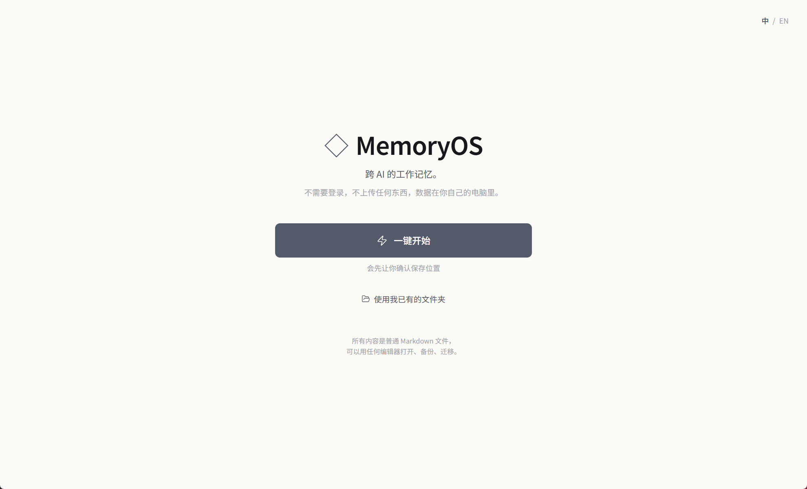
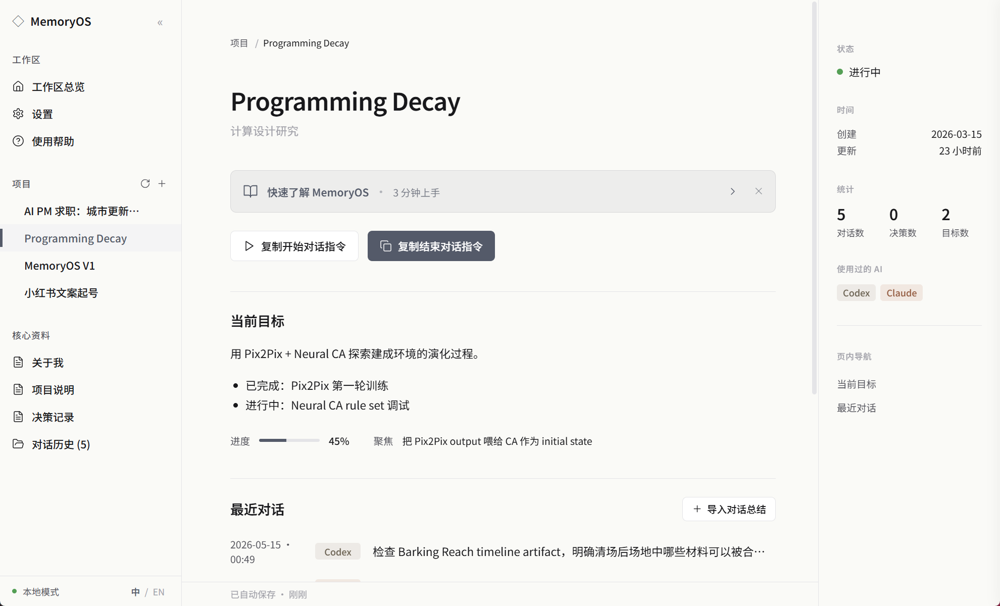
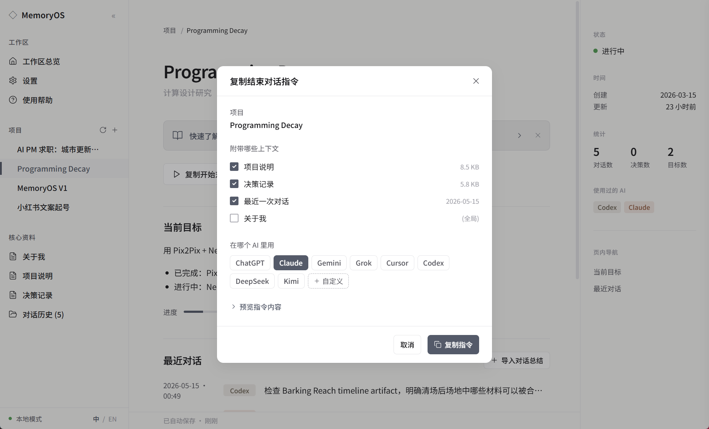
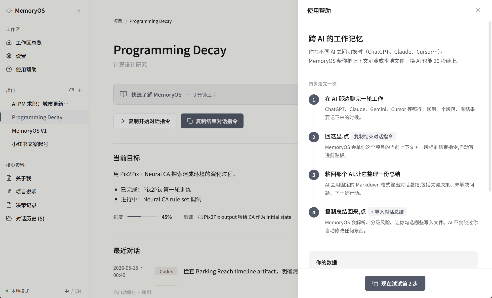

# ◇ MemoryOS

> 跨 AI 的本地工作记忆。一份上下文，接续所有 AI 工作流。
>
> *Your Context. Any AI. Every Workflow.*

[English](./README.en.md) · [下载安装包](../../releases) · [Issues](../../issues)

MemoryOS 是一个本地优先的桌面应用，帮你在 ChatGPT / Claude / Gemini / Cursor 等多个 AI 之间保留连续的工作记忆。所有数据都是你电脑上的 Markdown 文件——不上传任何东西，不需要登录，不依赖任何云服务。



---

## 它解决什么问题

你在不同 AI 之间切换工作时，每次开新对话都要重新告诉它你是谁、上次到哪了。ChatGPT 的 Memory 只对 ChatGPT 生效，Claude Projects 只对 Claude 生效，复制粘贴自己是谁三个月之后你会想砸键盘。

MemoryOS 不替代任何 AI 工具——它是这些工具之间的「工作记忆层」。

---

## 工作流

```
[新开一个 AI 对话]
    ↓
点【复制开始对话指令】
    ↓
粘贴到任意 AI → 它读取你的上下文
    ↓
工作一段时间…
    ↓
点【复制结束对话指令】
    ↓
粘贴到 AI → 它生成结构化总结
    ↓
复制总结回 MemoryOS → 点【+ 导入对话总结】
    ↓
Review → Save
```

下次任何 AI 都能从总结里 30 秒续上。



---

## 「复制结束对话指令」做了什么

点这个按钮，MemoryOS 把你勾选的上下文文件 + 一段标准化的结束指令打包写进剪贴板。选择你目前在用的 AI（ChatGPT / Claude / Gemini / Grok / Cursor / Codex / DeepSeek / Kimi，或自定义），再粘到 AI 里，它会按固定 Markdown 格式输出一份对话总结。



---

## 设计原则

1. **本地优先** — 所有数据是你拥有的 Markdown 文件
2. **AI 总结，用户确认** — 每个写入都要勾选 checkbox
3. **Append-first** — 不覆盖你已有的内容
4. **不抓对话** — handoff 由你复制粘贴，从不偷偷读取
5. **风险分级** — 对话总结低风险（默认保存）/ 项目说明中风险 / 关于我高风险（默认不勾 + 警告）
6. **删除可逆** — 删项目走系统回收站，5 秒内有撤销 toast

---

## 主要功能

- 🌍 **完整中英双语** — 一键切换，UI / Prompt 模板 / 示例项目展示都跟着语言走
- 🗂 **多项目工作区** — 侧栏管理多个项目，核心资料一目了然
- 🤖 **8 个预置 AI + 自定义** — ChatGPT / Claude / Gemini / Grok / Cursor / Codex / DeepSeek / Kimi
- 🛡 **删除走系统回收站** — 项目移到回收站可恢复，App 内还有 5 秒 Undo
- 📝 **纯 Markdown** — 用 Obsidian / VS Code / 任何编辑器都能打开
- 🎯 **风险分级导入** — AI 建议的更新会按风险等级分组，让你勾选保存



---

## 安装

### 直接用安装包（推荐 · Windows）

下载 [Releases](../../releases) 里的 `.exe`（一键安装）或 `.msi`（受管安装）。

Windows 会弹「未知发行者」警告（早期版本未做代码签名），点「更多信息 → 仍要运行」即可。App 不联网、不读你授权之外的文件。

### 从源码构建

需要：Node 18+ / Rust 1.70+ / Windows 上需要 VS Build Tools（C++ Desktop）

```bash
git clone https://github.com/jiajiajiang91-design/memoryos.git
cd memoryos
npm install
npm run tauri dev      # 开发模式
npm run tauri build    # 打包安装包
```

---

## 数据存在哪

默认 `~/Documents/MemoryOS/`，结构：

```
MemoryOS/
├── about_me.md                          ← 长期身份偏好（全局）
└── projects/
    └── <项目名>/
        ├── project.json                  ← 元数据
        ├── 00_context.md                 ← 项目快照
        ├── decisions.md                  ← 关键决策日志
        └── sessions/                     ← 历史对话总结
            ├── session_2026-05-15_1746.md
            └── session_2026-05-16_0030.md
```

任意编辑器都能打开（Obsidian / VS Code / 记事本），整个文件夹拷贝就是完整备份。

> 文件名保留英文供 AI 识别和外部工具兼容；UI 上显示为「关于我 / 项目说明 / 决策记录 / 对话历史」中文友好名。

---

## 技术栈

- **Tauri 1.5** — Rust 内核的桌面 app 框架（比 Electron 小 50 倍）
- **React 18 + TypeScript** — UI 层
- **Tailwind CSS** — 样式（Notion 风格 slate 蓝灰）
- **`trash` crate** — Rust 端实现跨平台回收站删除 / 还原
- **Vite** — 构建

打包后单个 Windows 安装包约 **1.7 MB**。

---

## 不做的事

- ❌ 云同步、账号系统
- ❌ 内置 AI Chat（不抢 ChatGPT / Claude 的活）
- ❌ 浏览器插件
- ❌ 移动端
- ❌ 自动抓取 AI 对话（handoff 必须由你主动粘贴）

如果这些是你的刚需，MemoryOS 不适合你。这些"不做"本身是产品立场的一部分。

---

## 路线图

- [x] v0.1.0 — 核心闭环、项目管理、Bootstrap 引导、Windows 安装包
- [x] **v0.1.1 — 中英双语 / 删除走系统回收站 + Undo / UX 打磨**（当前）
- [ ] v0.2 — 多 workspace 切换、设置面板、深色模式
- [ ] v0.3 — Mac / Linux build、代码签名
- [ ] v1.0 — App 内编辑 Markdown（不只 viewer）

---

## 反馈

[Issues](../../issues) 欢迎吐槽。最有价值的反馈：
- 哪一步上手最卡
- 你期望但没有的功能
- 你绝对用不上的功能（这个更重要）

---

## License

[MIT](LICENSE) © 2026 Jiajia
